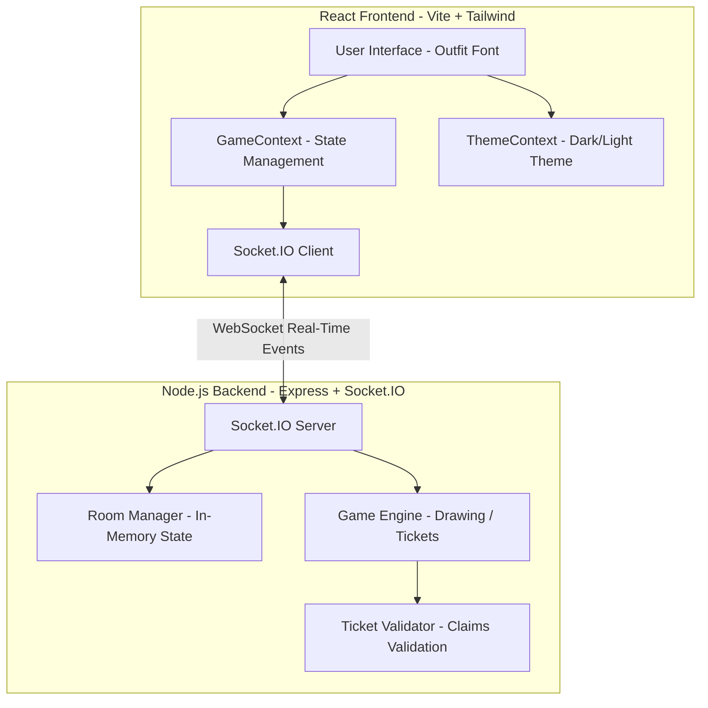
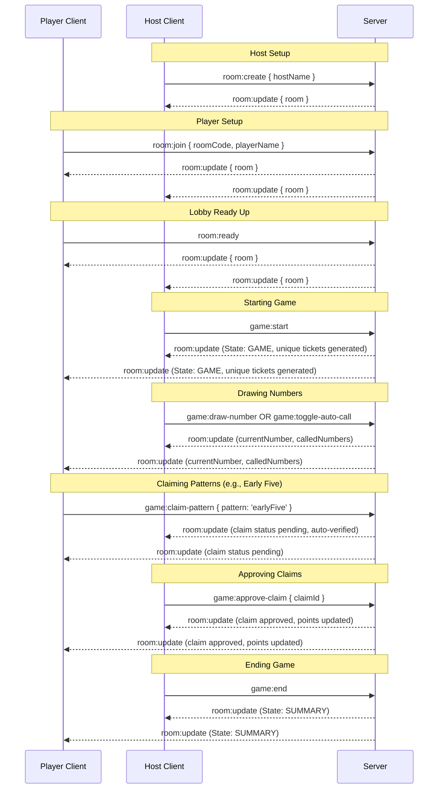
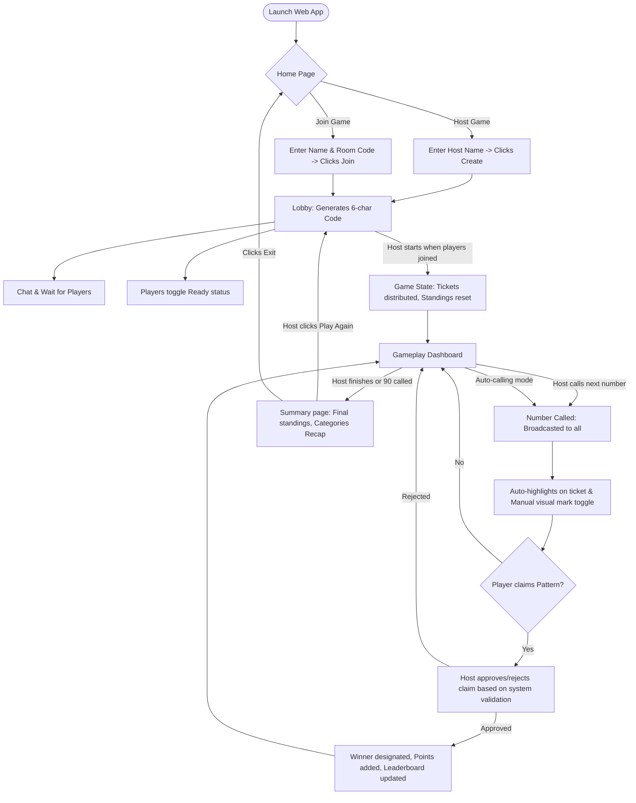

# 🎟️ Real-Time Multiplayer Tambola (Housie) Web Application

A modern, responsive, real-time multiplayer Tambola (Housie) web application built from scratch using a Node.js/Express backend, Socket.IO, and a React (Vite) frontend styled with Tailwind CSS. Perfect as a final-year college project.

---

## 🏗️ Architecture Diagram



---

## 📁 Folder Structure

```
Tambola/
  ├── backend/
  │    ├── index.js                     # Entry point (Server + Socket init)
  │    ├── package.json                 # Backend dependencies & scripts
  │    ├── server/
  │    │    └── app.js                  # Express middleware & routes
  │    ├── socket/
  │    │    └── socketHandler.js        # Socket.IO connection & event routing
  │    ├── rooms/
  │    │    └── roomManager.js          # Room registry & chat stores (In-Memory)
  │    ├── game/
  │    │    └── gameEngine.js           # Core loops & ticket generator
  │    └── utils/
  │         └── ticketValidator.js      # Pattern claim validation rules
  ├── frontend/
  │    ├── package.json                 # Frontend dependencies & scripts
  │    ├── tailwind.config.js           # Tailwind customization settings
  │    ├── postcss.config.js            # PostCSS plugin configurations
  │    ├── vite.config.js               # Dev server configuration and proxy routes
  │    ├── index.html                   # HTML template (responsive viewports & Google Fonts)
  │    └── src/
  │         ├── main.jsx                # React mount point & providers wrapper
  │         ├── App.jsx                 # Routing logic & Direct Link joiner
  │         ├── index.css               # Global imports & glassmorphism/mesh styles
  │         ├── context/
  │         │    ├── GameContext.jsx    # Real-time state socket event hub
  │         │    └── ThemeContext.jsx   # Dark/Light theme control
  │         ├── components/
  │         │    ├── LobbyChat.jsx      # Chat input/output container
  │         │    ├── PlayerList.jsx     # Waiting room player index & ready states
  │         │    ├── TambolaTicket.jsx  # Interactive ticket with auto/manual marks
  │         │    ├── NumbersBoard.jsx   # 1-90 board and last 10 called values
  │         │    ├── Leaderboard.jsx    # Real-time standings board
  │         │    ├── WinnerClaims.jsx   # Winning patterns lists & host controls
  │         │    └── ThemeToggle.jsx    # Dark/Light toggle sun/moon widget
  │         ├── pages/
  │         │    ├── Home.jsx           # Landing interface (Host/Join selectors)
  │         │    ├── Lobby.jsx          # Waiting room interface
  │         │    ├── Game.jsx           # Live gameplay dashboard
  │         │    └── Summary.jsx        # End recap and scoreboard
  │         └── utils/
  │              └── ticketGenerator.js # Client-side ticket generator reference
  └── README.md                         # Project documentation
```

---

## 🔄 Socket.IO Event Flow



---

## 🎮 Game Flow Diagram



---

## ⚡ Installation & Running Guide

Ensure you have **Node.js** and **npm** installed on your system.

### 1. Run the Backend

```bash
cd backend
npm install
npm run dev
```
*The backend server will run on `http://localhost:5000`.*

### 2. Run the Frontend

```bash
cd frontend
npm install
npm run dev
```
*The frontend Vite server will run on `http://localhost:3000` (configurable, accessible on local network).*

---

## 🔧 Troubleshooting Guide

### 1. WebSocket Connection Fails
* **Cause**: Backend server is not running, or network interfaces block connection.
* **Fix**: Ensure `backend` terminal displays `Server listening on port 5000`. If testing on a local network from a mobile phone, verify that your firewall allows connections on ports `3000` and `5000`, and that both devices are on the same Wi-Fi router.

### 2. Host Disconnections
* **Behavior**: If the Host leaves or refreshes, all players are automatically notified and redirected to the Home page.
* **Fix**: This is expected behavior to close resources. If you want to play again, host a new room and have players join via the new Room Code.

### 3. Duplicate Name Error
* **Behavior**: Player receives a toast saying the name is already taken.
* **Fix**: If a player disconnected due to network and attempts to rejoin immediately, wait 5 seconds for socket timeout or join with a slightly modified name (e.g. "Name 2").

---

## 🚀 Future Scope

1. **Authentication**: Integrate OAuth (Google/Github) or local passwords to save histories and player profiles.
2. **Persistent Database**: Save room histories, total games played, and cumulative points to a database (MongoDB/PostgreSQL).
3. **Multiple Tickets**: Allow players to buy or request multiple tickets (up to 6) in a single room.
4. **Custom Rules**: Support customized winning patterns (e.g. Corners, Star, 1st Line, 2nd Line, 3rd Line).
5. **Theme Shop**: Interactive sound effects (number call voices) and customized background themes.
